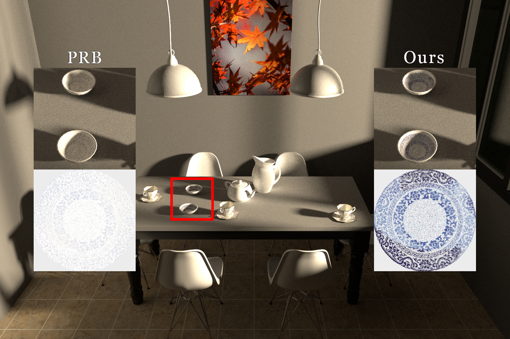

# Conditional Mixture Sampling

importance sampling light path derivatives using a deterministic mixture of primal and differential distributions, with the optimal mixture weight conditioned on the BSDF of each vertex in the path prefix

**Conditional Mixture Path Guiding for Differentiable Rendering**

Zhimin Fan, Pengcheng Shi, Mufan Guo, Ruoyu Fu, Yanwen Guo, Jie Guo

*ACM Transactions on Graphics (Proceedings of SIGGRAPH 2024)*

## Abstract

The efficiency of inverse optimization in physically based differentiable rendering heavily depends on the variance of Monte Carlo estimation. Despite recent advancements emphasizing the necessity of tailored differential sampling strategies, the general approaches remain unexplored.

In this paper, we investigate the interplay between local sampling decisions and the estimation of light path derivatives. Considering that modern differentiable rendering algorithms share the same path for estimating differential radiance and ordinary radiance, we demonstrate that conventional guiding approaches, conditioned solely on the last vertex, cannot attain this density. Instead, a mixture of different sampling distributions is required, where the weights are conditioned on all the previously sampled vertices in the path. To embody our theory, we implement a conditional mixture path guiding method that explicitly computes optimal weights on the fly. Furthermore, we show how to perform positivization to eliminate sign variance and extend to scenes with millions of parameters.

To the best of our knowledge, this is the first generic framework for applying path guiding to differentiable rendering. Extensive experiments demonstrate that our method achieves nearly one order of magnitude improvements over state-of-the-art methods in terms of variance reduction in gradient estimation and errors of inverse optimization.

## Links

[Paper](https://zhiminfan.work/paper/conditional_mixture_preprint.pdf)